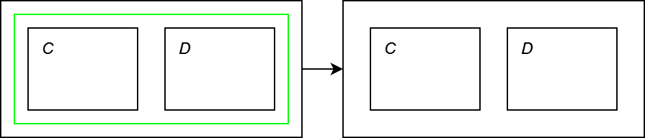
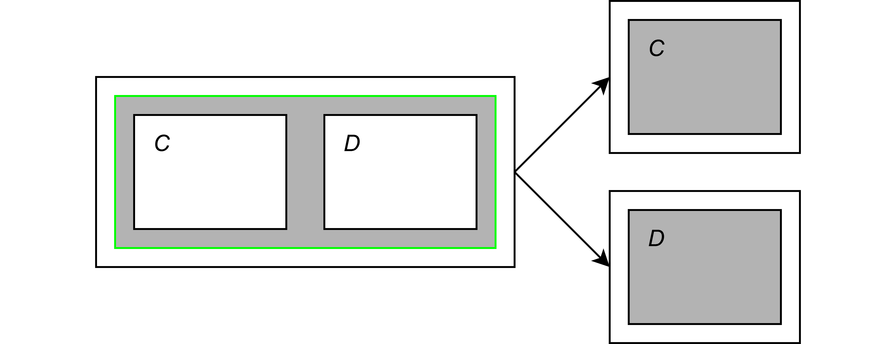
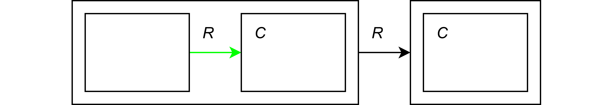
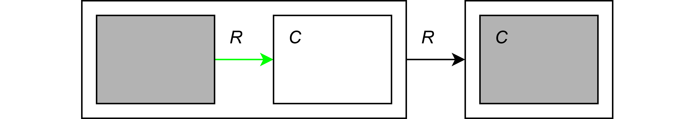
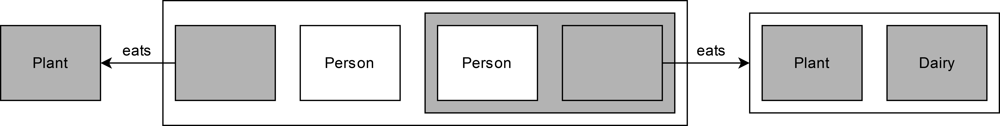
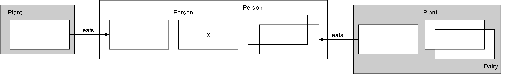
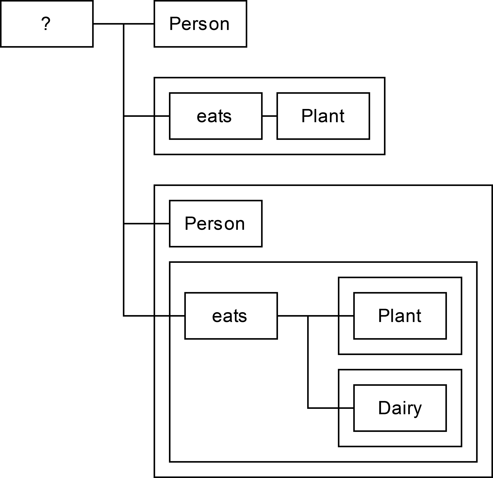

# Diagrammatic reasoning for Logic Graphs

## Algorithm

- build a logic graph for the initial concept
- build a tree applying the rules until it is possible:
  - ⊓+-rule:

    
  - ⊓--rule:

    
  - ∃+-rule:

    
  - ∃--rule:

    
- if each branch of the tree contains a clash, the initial concept is inconsistent. Clash:

  
- otherwise, it is consistent

## Examples

- inconsistent: a person who is vegan, but not a vegetarian, i.e. a person who eats only plants, but eats not only plants or dairy

<a href="inconsistent/inconsistent1.html">Person ⊓ ∀eats.Plant ⊓ ¬(Person ⊓ ∀eats.(Plant ⊔ Dairy))</a>

- consistent: a person who is vegan and vegeratian, i.e. a person who eats only plants and only plants or dairy

<a href="consistent/consistent1.html">Person ⊓ ∀eats.Plant ⊓ ∀eats.(Plant ⊔ Dairy)</a>

## Comparison
- Logic Graphs

- Conceptual Diagrams

- Relation Graphs

We compare the complexity of visual syntaxes regarding their graph-theoretic terms.

|    | N of nodes | N of edges | Depth |
| -- | ---------- | ---------- | ----- |
| LG | **_10_** | **_2_** | **_2_** |
| CD | 11 | **_2_** | 3 |
| RG | 13 | 5 | 3 |
